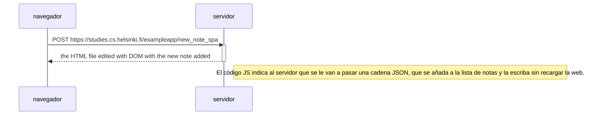

```mermaid
sequenceDiagram
    participant navegador
    participant servidor

    navegador->>servidor: POST https://studies.cs.helsinki.fi/exampleapp/new_note_spa
    activate servidor
    servidor-->>navegador: the HTML file edited with DOM with the new note added
    deactivate servidor

    Note right of servidor: El código JS indica al servidor que se le van a pasar una cadena JSON, que se añada a la lista de notas y la escriba sin recargar la web.
```