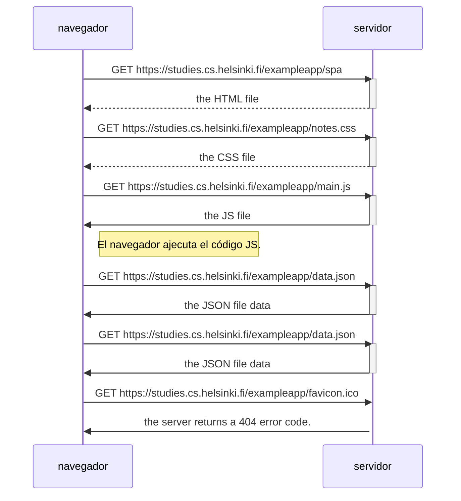

```mermaid
sequenceDiagram
    participant navegador
    participant servidor

    navegador->>servidor: GET https://studies.cs.helsinki.fi/exampleapp/spa
    activate servidor
    servidor-->>navegador: the HTML file
    deactivate servidor

    navegador->>servidor: GET https://studies.cs.helsinki.fi/exampleapp/notes.css
    activate servidor
    servidor-->>navegador: the CSS file
    deactivate servidor

    navegador->>servidor: GET https://studies.cs.helsinki.fi/exampleapp/main.js
    activate servidor
    servidor->>navegador: the JS file
    deactivate servidor

    Note right of navegador: El navegador ajecuta el código JS.

    navegador->>servidor: GET https://studies.cs.helsinki.fi/exampleapp/data.json
    activate servidor
    servidor->>navegador: the JSON file data
    deactivate servidor

    navegador->>servidor: GET https://studies.cs.helsinki.fi/exampleapp/data.json
    activate servidor
    servidor->>navegador: the JSON file data
    deactivate servidor

    navegador->>servidor: GET https://studies.cs.helsinki.fi/exampleapp/favicon.ico
    activate servidor
    servidor->>navegador: the server returns a 404 error code.
```